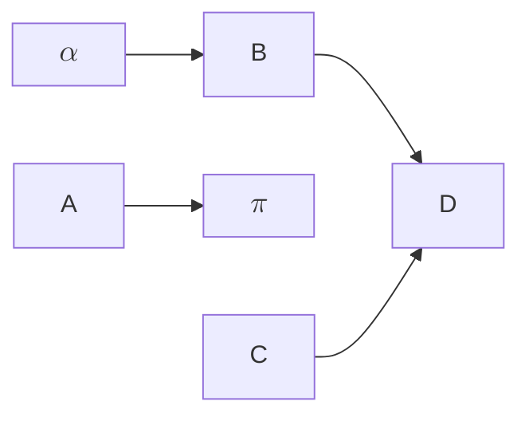

# 
物理实验报告 

 
陈建烨 12411913 2025.. 星期二下午
 <!---这里是姓名栏--->

### 一. 实验名称：<u>114514</u>
<!---课程名称写<u>和</u>之间--->
### 二. 实验目的 

### 三.实验原理

### 四.实验仪器

### 五.实验内容

### 六.实验数据

| aa | bb |
|:---:|:---:|
| $ djhd=x^2*a_{2n+1} $  |   |
|    |    |

|   序号   |   内容  |        描述         |
|  :---:  |  :---:  |  :---------------:  |
|    1    |    l    |  大写字母L的小写字母l |
|    2    |    I    |      大写字母I       |
|    3    |    1    |        数字1       |

<table>
    <tr>
        <td>1</td>
        <td>2</td>
        <td>3</td>
    </tr>
    <tr>
        <td colspan=2>
4
</td>
        <td rowspan=2>
5
</td>
    </tr>
    <tr>
        <td>6</td>
        <td>7</td>
    </td>

</table>

 

### 七.数据处理

### 八.误差分析

### 九.实验结论

### 十.思考题

$$g=\frac{4\pi^2l}{T^2}$$

$a\times 10^{b}$

$\rightleftarrows$
$\Rightarrow$
$\Leftrightarrow$
$\Leftarrow$

$\pm \mp$

$\approx$

$U_{a,l_0}=\sqrt{\frac{\Sigma(l_{0,i}-\bar l)^2}{n*(n-1)}}*t_{0.95}$
$\bar l_{0}=\frac{\Sigma l_{0,i}}{n}$
$
Error=\frac{\Delta g}{g_0}*100\%
$
$\bar l_0=\frac{l_{0,1}+l_{0,2}+l_{0,3}+l_{0,4}+l_{0,5}}{5}$

$$
M=
 \left[
 \begin{matrix}
   1 &  &  &\\
     & -1 & &\\
     & & 1 & \\
     & & & -1
  \end{matrix}
  \right] 
$$

$$
A=
\left[
    \begin{matrix}
    2&1&&\\
    1&2&1&\\
    &1&2&1\\
    &&1&2
    \end{matrix}
\right]
$$
$$
MAM^-1=\left[
    \begin{matrix}
    2&-1&&\\
    -1&2&-1&\\
    &-1&2&-1\\
    &&-1&2
    \end{matrix} 
\right]
\not=
\left[
    \begin{matrix}
    1&&&\\
     &1&&\\
    & &1& \\
    && &1
    \end{matrix} 
\right]
$$

$$
g=\frac{4\pi^{a_n}l}{T_i^2}=\sqrt{x^2+h}+\alpha+\beta+\phi+\Phi+{{\sigma x}\over{\delta y}}*\Delta z
$$

$$
\sqrt[6]{x^2}=
\sum_1^{x^{1\over3}} \int_{-\infty}^\infty
\iint
\int\int\int\int
\iiint
\prod
$$
$$
0 \le\frac{n!}{n^n}\le{1 \over n} 
$$
$
\{a_n\} \forall n \gets \to a_n\le a_{n+1}，\\
\forall \epsilon >0 \exist n>N \Leftrightarrow
$